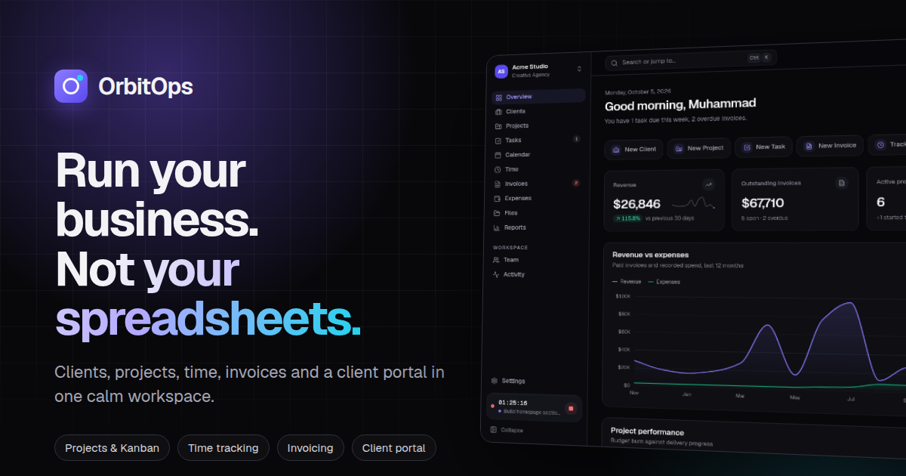

# OrbitOps

**Run your business. Not your spreadsheets.**

OrbitOps is a multi-tenant business operations workspace for agencies, studios and service teams. Clients, projects, tasks, time, invoices, expenses, files, reports and a branded client portal live in one place, with a marketing site in front of it.



Built with Laravel 13, Inertia.js 3, Vue 3, Tailwind CSS 4, Vite, MySQL, Laravel Reverb, Fortify, Sanctum and Spatie Permission. There are no AI or other paid third-party APIs.

---

## Quick start

Requirements: PHP 8.3+, Composer 2, Node 20+ and MySQL 8 (SQLite also works for local development and tests).

```bash
git clone https://github.com/Muhammad-Husnain-Web-Developer/orbitops.git
cd orbitops
composer install
cp .env.example .env            # then set DB_* credentials
php artisan key:generate
php artisan migrate --seed      # schema + demo workspaces
php artisan storage:link        # avatars and workspace logos
npm install && npm run build
composer dev                    # server, queue, Reverb, scheduler, logs, Vite
```

Open http://localhost:8000. Both the home page and the login page have one-click demo buttons.

### Demo accounts

All demo users have the password `password`.

| Persona | Email | What you see |
| --- | --- | --- |
| Owner, Acme Studio | `demo@orbitops.app` | Everything: three workspaces (Acme Studio, Nova Labs, PixelFoundry) |
| Client contact, Northstar Media | `client@orbitops.app` | The client portal only |
| Admin | `sarah@acmestudio.test` | Admin role in Acme Studio |
| Manager | `james@acmestudio.test` | Projects, finance, approvals |
| Member | `priya@acmestudio.test` | Delivery work, own time, no invoices or reports |
| Another tenant | `noah@pixelfoundry.test` | Owner of PixelFoundry, for isolation testing |

The demo data is relative to today: twelve months of invoices, six months of tracked time, live overdue invoices, a running timer, a milestone awaiting client approval, notifications and an activity history. Re-run `php artisan migrate:fresh --seed` at any time to reset it.

While `ORBITOPS_DEMO_LOGIN=true`, the shared demo accounts can't change their password, email, two-factor settings or sessions, and can't delete, leave or transfer the demo workspace. Without this, one visitor could lock everyone else out. Set the flag to `false` in production.

---

## What's inside

**Marketing site**
- GSAP hero sequence and scroll storytelling.
- Interactive product showcase.
- Features, pricing with a monthly/yearly toggle, about, contact (validated, rate-limited, honeypot), changelog, docs and legal pages.
- SEO and Open Graph tags rendered on the server.

**Accounts**
- Registration creates your workspace.
- Email verification, password reset and password confirmation.
- Two-factor authentication with recovery codes.
- Browser-session management.
- Invitations, one-click demo login.

**Workspace**
- **App shell:**
  - Collapsible sidebar, workspace switcher and global search.
  - ⌘K command palette and keyboard shortcuts.
  - Quick-create, live notifications and a running timer.
  - Mobile navigation, dark and light themes, per-workspace accent colour.
- **Overview:** KPIs with trends, revenue/expense and hours charts, project health, deadlines, overdue invoices and live activity.
- **Clients:** list, detail with notes, projects, invoices and files.
- **Projects:** list and cards, milestones (with optional client approval), Kanban board, files, client thread.
- **Tasks:**
  - Workspace-wide Kanban with drag and drop (ordering persists, and teammates' boards update in real time), plus a list view.
  - URL-addressable task drawer with comments, @mentions, attachments and activity.
- **Calendar:** tasks, milestones, project deadlines and invoice due dates.
- **Time:** one-click timer (one per person), manual entries, weekly timesheet, billable split.
- **Invoices:**
  - Line-item editor with live totals and "add billable hours" from tracked time.
  - Printable paper invoice, email sending, partial payments, duplicate/cancel rules.
  - Daily overdue flagging.
- **Expenses:** receipts, approval queue, categories, billable costs, spend charts.
- **Files:** project folders, type filters, storage usage, client sharing.
- **Reports:**
  - Profit and loss, collections, hours, team utilization, client revenue and project profitability.
  - Preset or custom ranges, with a CSV export.
- **Team:** roles, capacity, utilization, bulk invitations with seat limits, client portal access.
- **Activity:** an infinite, filterable timeline.
- **Notifications:** an in-app centre with live updates and per-type in-app/email preferences.
- **Settings:**
  - Profile, notifications, security, appearance.
  - Workspace branding and invoicing defaults.
  - Roles and permissions editor, billing plans, integrations roadmap, API tokens, danger zone.

**Client portal** (for client-role users)
- Overview, projects with a milestone timeline, shared tasks and files.
- Invoices, with print/PDF.
- Per-project message threads.
- Milestone approvals: approve, or request changes with a note.

**Errors:** branded 403, 404, 419 (session refresh), 429, 500 and 503 pages.

---

## Architecture

### Multi-tenancy

- **Current workspace:** every request resolves a workspace from the user's active membership (`SetCurrentWorkspace`). The middleware runs before route-model binding, so bound models are already tenant-scoped.
- **Data scoping:** every tenant-owned model uses `BelongsToWorkspace`. That adds a global `WorkspaceScope` and fills `workspace_id` on create. Records from another workspace are simply not found (404).
- **Form input:** form requests validate referenced IDs inside the current workspace (`ValidatesTenantReferences`). A client, project, task or member ID from another workspace fails validation.
- **Files:** stored privately under `storage/app/private/workspaces/{id}` and streamed only through authorized routes.
- **API tokens:** each token is bound to one workspace (`workspace:{id}` ability). `ResolveTokenWorkspace` re-checks membership on every request.

### Permissions

- Spatie Permission runs in teams mode, with `workspace_id` as the team key. Each workspace gets its own owner, admin, manager, member and client roles. Owners can tailor them under **Settings → Roles & permissions**.
- Every controller action is authorized on the server by policies that check both workspace membership and the permission. The UI only hides controls and is never relied on.
- Client-role users are confined to `/portal` (`EnsureClientPortal`), and team routes redirect them. Portal controllers add a second scope to the contact's own client. They return data through an explicit presenter, so budgets, rates and internal tasks never reach clients.
- Invoice and expense activity is filtered by permission in queries and broadcast on separate private channels (`workspace.{id}.invoices` / `.expenses`).

### Realtime, queues and scheduling

- **Reverb broadcasts:** activity, Kanban moves and notifications on private channels authorized in `routes/channels.php`. Echo is loaded lazily. To run without Reverb, set `BROADCAST_CONNECTION=log`: everything works, just without live updates. With `reverb` configured, keep `reverb:start` running, or broadcast jobs will fail and land in `failed_jobs`.
- **Queue:** notifications are queued (database driver by default) and honour each user's channel preferences.
- **Scheduler:** `invoices:flag-overdue` runs daily at 06:05 and notifies whoever manages billing. `composer dev` runs the scheduler for you; in production, add the usual `* * * * * php artisan schedule:run` cron entry.

### Frontend

- **Inertia and layouts:** Inertia 3 pages in `resources/js/Pages`, with persistent per-area layouts (marketing, auth, app, settings, portal, errors). Deferred props back the charts, and infinite scroll backs the activity timeline.
- **UI primitives:** one design system in `resources/js/Components/UI`, including a single toast system, one modal/drawer/dialog stack with focus trapping, and form controls.
- **Theming:** tokens are CSS variables (`resources/css/app.css`) with a dark theme by default.
- **Charts:** hand-built SVG with validated palettes, crosshair tooltips and screen-reader data tables.

### Accessibility and responsiveness

- An axe-core audit (WCAG 2.1 AA, serious and critical) of 37 pages passes in both themes.
- No page scrolls horizontally at 390, 768 or 1024px.
- Keyboard support: skip link, focus management, labelled controls and `prefers-reduced-motion` handling.

---

## API

Create a token under **Settings → API**. Tokens are read-only, or read/write (tasks), and are bound to the workspace they were created in.

```bash
curl http://localhost:8000/api/v1/projects \
  -H "Authorization: Bearer YOUR_TOKEN" -H "Accept: application/json"
```

| Method | Endpoint | Notes |
| --- | --- | --- |
| GET | `/api/v1/me` | Token user, workspace and abilities |
| GET | `/api/v1/projects`, `/api/v1/projects/{id}` | `?status=` |
| GET | `/api/v1/clients` | |
| GET | `/api/v1/tasks` | `?project=&status=&assignee=` |
| POST | `/api/v1/tasks` | requires `write` |
| PATCH | `/api/v1/tasks/{id}` | requires `write` |
| GET | `/api/v1/time-entries` | own entries unless you can view everyone's |
| GET | `/api/v1/invoices` | `?status=` |

Responses are paginated (`?per_page=`, max 100). Rate limit: 120 requests per minute.

---

## Testing and quality

```bash
php artisan test             # 41 feature and unit tests (SQLite in-memory by default)
DB_CONNECTION=mysql DB_DATABASE=orbitops_testing php artisan test   # same suite on MySQL
./vendor/bin/pint --test     # code style
npm run build                # production assets
php artisan route:list       # 160+ routes
```

The tests cover:
- Cross-workspace isolation: pages, forms, files and API tokens.
- Permissions enforced on the server, and live role edits.
- Client portal scoping and approvals.
- Registration, login, two-factor challenge, and demo login with its protections.
- Invoice totals, numbering, payments and overdue flagging.
- Timers and time entries, and finance activity visibility.
- CSV export safety, error pages, SEO tags, and the reporting maths.

---

## Configuration notes

| Variable | Purpose |
| --- | --- |
| `ORBITOPS_DEMO_LOGIN` | Demo login buttons and demo-account protections (`false` in production) |
| `BROADCAST_CONNECTION` | `reverb` for realtime, `log` or `null` to run without it |
| `REVERB_*`, `VITE_REVERB_*` | Reverb server credentials and the client connection |
| `QUEUE_CONNECTION` | `database` by default; run a worker (`php artisan queue:work`) in production |
| `MAIL_*` | Invitations, invoice emails, verification and notification emails |

Plans, prices (placeholders), seat, project and storage limits, and the blended hourly rate used by reports are in `config/orbitops.php`.

### Not included (by design)

- **No payment provider.** Plan changes apply instantly, and the billing page says so.
- **No live integrations.** The integrations page lists Slack, Stripe, QuickBooks and others as roadmap items.
- **No AI features.**
